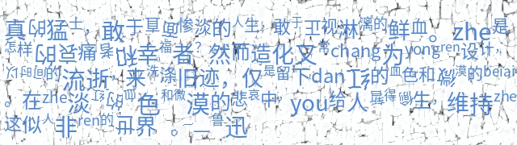
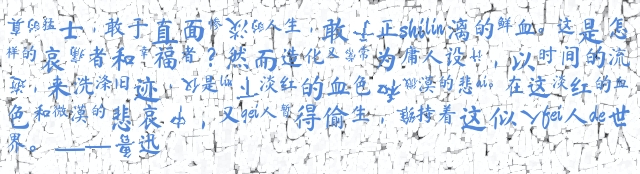
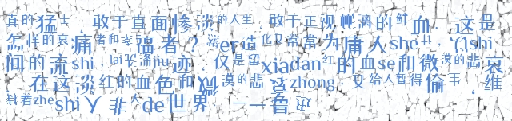
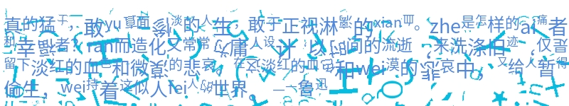
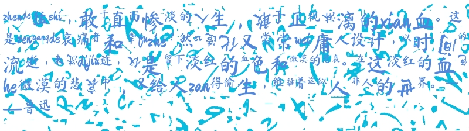

# antiOCR

**Anti OCR, Free Texts.**

拒绝图片文字被OCR，让文字自由传播！  **antiOCR** 把指定文本转换成机器无法识别但人可读的文字图片。


欢迎扫码加小助手为好友，备注 `anti`，小助手会定期统一邀请大家入群：

<div align="center">
  
</div>


作者也维护 [**知识星球私享群**](https://t.zsxq.com/FEYZRJQ) ，这里面的提问会较快得到作者的回复，欢迎加入。**知识星球私享群**也会陆续发布一些开源项目相关的私有资料，包括一些**使用教程**，**未公开的模型**，**不同应用场景的调用代码**，使用过程中遇到的难题解答等。本群也会发布一些相关的最新研究资料。


## 使用说明


调用很简单，以下是示例：

```python
from antiocr import AntiOcr

texts = '拒绝图片文字被OCR，让文字自由传播！  antiOCR 把指定文本转换成机器无法识别但人可读的文字图片。'
anti = AntiOcr()

# 生成文字图片
img = anti(
    texts,
    font_fp='/System/Library/Fonts/PingFang.ttc',  # 使用的字体文件
)
img.save("output.png")

```


使用示例可以参考 [Streamlit Demo](antiocr/app.py) 。


目前 antiOCR 使用的反OCR方法主要包括：

* 每个文字随机使用不同大小的字体；
* 每个汉字按指定概率进行倒转（随机生成倒转角度）；
* 每个汉字按指定概率转换为中文拼音；
* 【可选】随机生成干扰的背景图片；
* 字体可按需指定；


## 示例

<table>
<tr>
<td> 生成的图片 </td> <td> 背景图片来源 </td>
</tr>
<tr>
<td>
 
</td>
<td>
固定图片
</td>
</tr>
<tr>
<td>
 
</td>
<td>
固定图片
</td>
</tr>
<tr>
<td>
 
</td>
<td>
固定图片
</td>
</tr>
  <tr>
<td>
 
</td>
<td>
随机图片
</td>
</tr>
<tr>
<td>
 
</td>
<td>
随机图片
</td>
</tr>
<tr>
<td>
 
</td>
<td>
随机图片
</td>
</tr>
</table>


## 安装

嗯，顺利的话一行命令即可。

```bash
pip install antiocr
```

安装速度慢的话，可以指定国内的安装源，如使用豆瓣源：

```bash
pip install antiocr -i https://pypi.doubanio.com/simple
```


## 给作者来杯咖啡

开源不易，如果此项目对您有帮助，可以考虑 [给作者加点油🥤，鼓鼓气💪🏻](https://cnocr.readthedocs.io/zh/latest/buymeacoffee/) 。

---

官方代码库：[https://github.com/breezedeus/antiocr](https://github.com/breezedeus/antiocr)。
